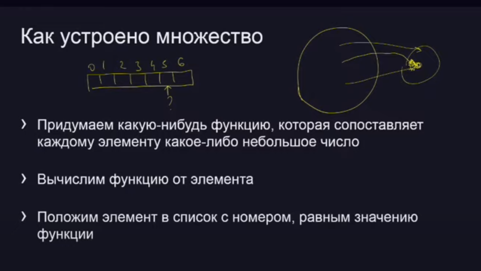
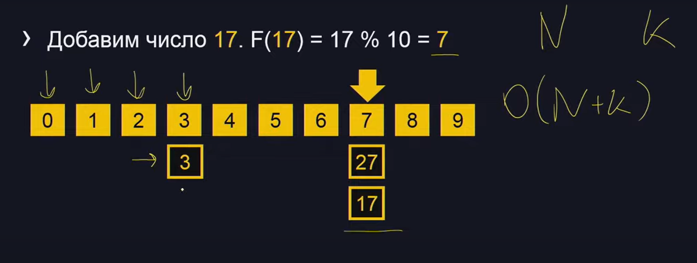
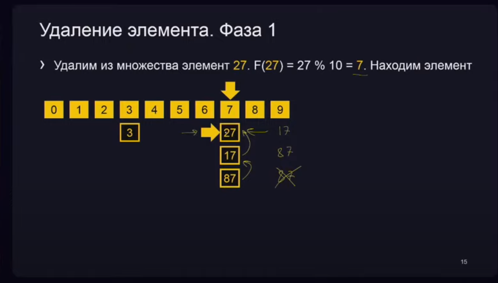
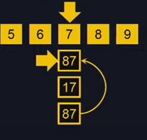
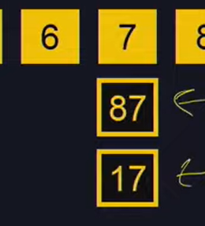

# Множества

## Добавление и поиск элемента
Сложность O(N+K)
O(N) - пройтись по элементам хеш-функции
O(K) - пройтись по списку конкретного элемента

## Удаление элемента
нужно удалить число 27 в списке 7.

Эффективно можно сделать если записать туда значение последнего элемента и последний элемент удалить.
Сложность O(1)

